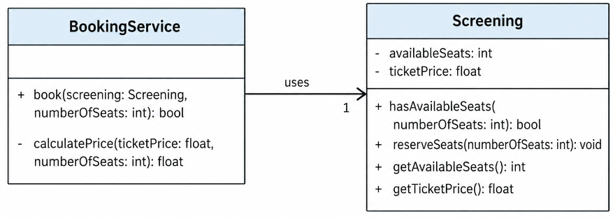

# Classical vs. London approaches to unit testing
Example of the two main unit testing schools of thought.

The system under test is a movie theatre ticket booking application with two services.

**Implementation-independent class diagram**

## Usage
Run the tests: 
    - `npm run test`. All the tests
    - `npm run test:classical`. Classical unit tests only
    - `npm run test:london`. London unit tests only

## Tools
Jest / JavaScript

## Author:
ChatGPT-5.6 Sol, prompted by Arturo Mora-Rioja.